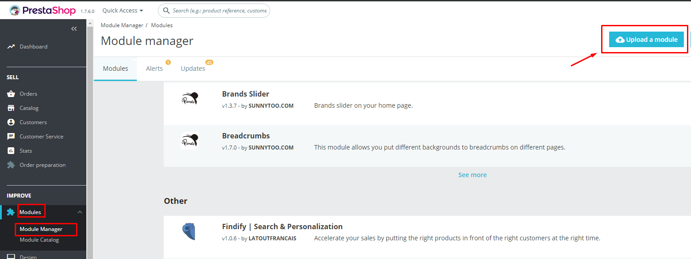
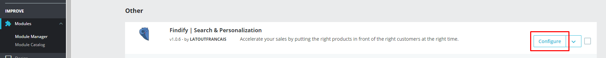
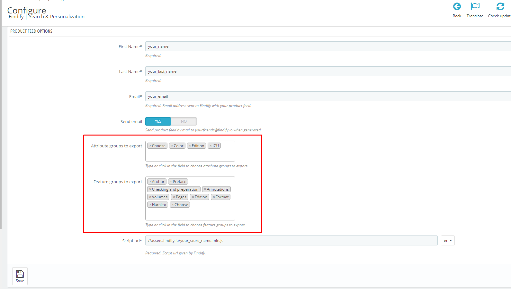
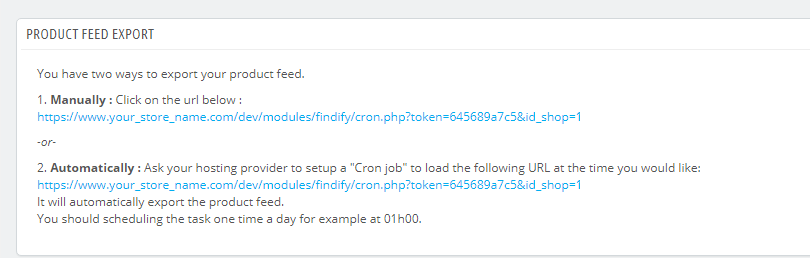
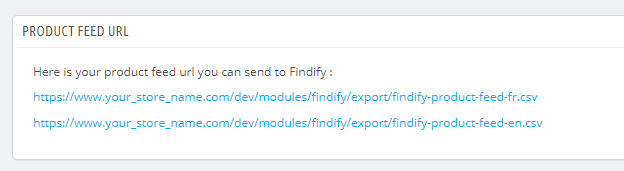
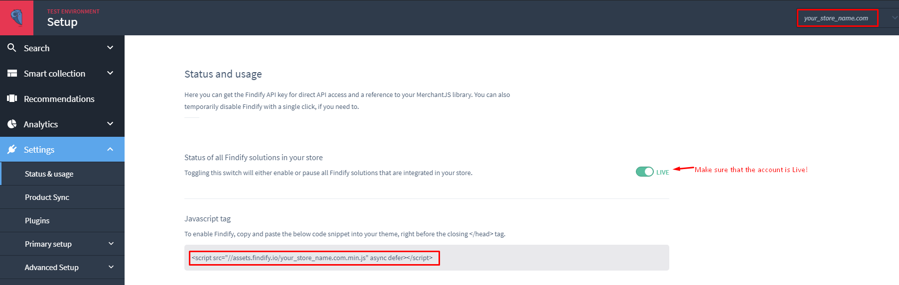
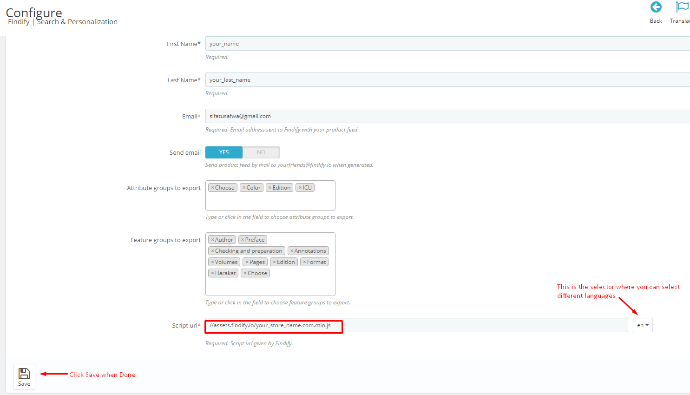
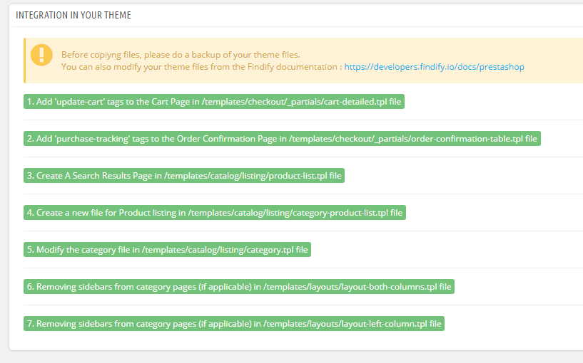
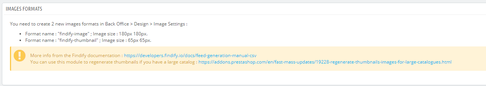

Findify for PrestaShop
=====================

The Findify extension allows you to generate a product feed containing all enabled products of your Prestashop store view.
For a multi-language or a multi-sites store, a distinct feed can be generated for each store view.

## Compatibility

This module is compatible with **PrestaShop +1.6 and +1.7**.

## 1. How to install the extension?

* Download the compressed [ZIP file](https://findify-assets.s3.amazonaws.com/findify-prestashop-module-v1.0.6a.zip) containing the extension from Github.
* Go to **PrestaShops backoffice -> Module -> Module Manager** and click on **Upload Module**:

* Drag & Drop the downloaded Zip file into the popup window to install the module.
* Once installed, the Module Manager section will have the Findify Module installed. Click on **Configure** the module:

## 2. Configuration

### 1. Setup the product feed and provide your information.
* Provide your first, last name and email.
* **Send Email**: if yes - the product feed url and your information will be sent to Findify support (you can alternatively send the product feed url and information directly to Findify Support).
* Select the **Attributes** and **Features** that you would like to export from PrestaShop to the product feed url. Some of the required fields will be exported by default (for more information, please refer to [Mandatory Fields](https://developers.findify.io/docs/feed-generation-manual-csv#mandatory-fields)).

* Click **Save** to Save the changes.

### 2. Setup the product feed exporter.

There are 2 ways to update the product feed data:
* **Manual Update.** Click on the link next to the **Manual** section. Depending on the amount of products - it will update the product information with the up to date data.
* **Scheduled Update.** You can setup a separate **Cron Job** to run the automatic scheduled updates using the link shared in the **Automatic** section.

### 3. Product Feed url.
All of your product feeds will be available in the **Product Feed Url** section:

The amount of product feed urls will depend on the amount of languages you have setup in PrestaShop.
You can share these product feed urls to Findify Support ([yourfriends@findify.io](yourfriends@findify.io)) in order to onboard the account.

### 4. Adding the Script Tag to the Module.
Once the account is onboarded in Findify, you will receive access to [Findify's Merchant Dashboard](https://dashboard.findify.io/).
Each language (product feed) will have it's own separate account in Findify.
For each account you can do to our **dashboard -> Settings -> Status & Usage** and copy the **src** of the script tag provided:

Into the Module:

Hit **Save** once the script information is added.

### 5. Integration Steps.
In order to integrate Findify related code into your store, you would need to click through all the Integration Steps in the Module:

**Make Sure that you have a backup of all of theme files before doing automatic changes below!
Alternatively, you can follow [Search Results](https://developers.findify.io/docs/integrations-custom-steps#3-setup-the-search-page) and [Analytics](https://developers.findify.io/docs/integrations-custom-steps#4-feedback-integration) guide to integrate Findify manually:**

* **Action 1-2** - Will add Analytics Tags needed (For more info: [Analytics Integration](https://developers.findify.io/docs/integrations-custom-steps#4-feedback-integration) guide).
* **Action 3** - Will create a Search Results Page (For more info: [Search Results Page Integration](https://developers.findify.io/docs/integrations-custom-steps#3-setup-the-search-page)).
* **Action 4-7** - Will integrate Smart Collections, if applicable (For more info: [Smart Collections Integration](https://developers.findify.io/docs/prestashop-smart-collections)).

### 6. Images Format.
You can change the size of the images by looking into the **Images Format** section of the Module:

